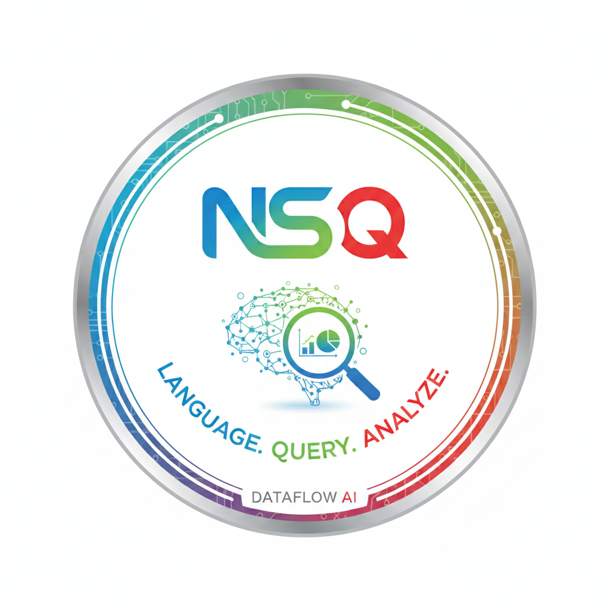

# Santhosh C
**Data Analyst | AI-Driven Analytics | SQL Intelligence**

  
  

---

## ⚡ Technical Arsenal

| Category | Tools & Technologies |
| :--- | :--- |
| **AI & Analytics** | NL2SQL, Prompt Engineering, Ollama (Local LLMs), Qwen-2.5, LangChain |
| **Data Engineering** | MySQL (Expert), Python (Pandas/NumPy), ETL Automation, Power Query |
| **Visualization** | Power BI, Streamlit, Plotly, Seaborn |
| **Core SQL** | Window Functions, CTEs, Self-Healing Query Logic, Schema Analysis |

---

## 📊 Key Data Projects

### 🔹 AI Data Assistant  
**Python | SQL | Ollama | Streamlit**

- Architected an **enterprise-grade NL2SQL platform** enabling non-technical users to query any MySQL database using plain English
- Engineered a **self-healing SQL engine** that analyzes schema, fixes syntax errors, and regenerates queries using LLM feedback loops
- Built a **universal intent engine** that derives missing metrics and creates calculated fields (e.g., Quantity × Price) dynamically
- Implemented an **intelligent visualization layer** that auto-selects optimal charts (Bar, Line, Scatter, Area, Donut)
- Designed a **decision-support layer** generating Observation–Insight–Recommendation outputs using a **fully local Qwen-2.5 LLM**, ensuring data privacy

🔗 **Project Repository:** *(add your GitHub repo link here)*

---

### 🔹 Employee Attrition Intelligence  
**MySQL | Power BI | Excel**

- Automated ETL pipelines for **1,400+ employee records**, reducing data preparation time by **40%**
- Identified a **30.5% attrition rate** linked to excessive overtime, highlighting burnout-prone roles
- Discovered a **21% churn spike** tied to promotion stagnation using SQL-based role profiling
- Developed interactive **Power BI dashboards** visualizing critical attrition KPIs for leadership decision-making

---

## 💼 Professional Experience

### Junior Systems Administrator  
**Edify Technologies, Inc**  
*September 2023 – May 2025*

- Automated IT workflows using **Jira**, improving operational efficiency by **25%**
- Maintained **99.9% audit accuracy** in system reports supporting **CMMI Level-5 compliance**

---

## 🎓 Education

**B.E. Computer Science**  
Hindusthan Institute of Technology  
*August 2019 – March 2023*

---

## 📜 Certifications

- **Microsoft Certified: Azure Fundamentals (AZ-900)**

---

## 🌟 What I’m Working On
- Advanced NL2SQL reasoning systems
- Enterprise analytics automation
- Privacy-first AI for business intelligence

---

## 📂 Project Gallery
*Select a project to view deep-dives and documentation.*

| **AI Data Assistant** | **Employee Attrition** | **Future Project** |
| :---: | :---: | :---: |
|  |  |  |
| [Project Repository ➔](https://github.com/Santhosh0809/AI-Data-Assistant.git) | [Project Repository ➔](https://github.com/Santhosh0809/AI-Data-Assistant.git) | [Coming Soon ➔](#) |

---
